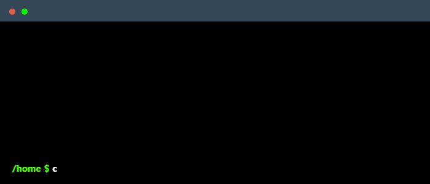

<!-- ========================================================= -->
<!--                         HEADER                            -->
<!-- ========================================================= -->

  

  
  &nbsp;
  

<!--
     Your own Terminal GIF can be created here -> https://www.terminalgif.com
-->

    

 

  
  
  
  

<!-- Animated divider -->

  

<!-- ========================================================= -->
<!--                    TECHNOLOGY STACK                       -->
<!-- ========================================================= -->

  

# 🛠️ Technology Stack

 

  

  

 

  

  

 

  

  

 

  

  
    
  
  
  
  

 

  

  

 

  

  

  
  
  

<!-- ========================================================= -->
<!--                    FEATURED PROJECT                       -->
<!-- ========================================================= -->

  

# 🚀 Featured Project

<table width="100%">
<tr>

<td width="38%" valign="top">

<h2 align="center">🐾 PawTrace</h2>

<b>Pet Identification & Safety Platform</b>

 

  

  

  

  

</td>

<td width="62%" valign="top">

### 🐾 Full-Stack Pet Identification & Safety App

**PawTrace** is a full-stack pet identification and safety application designed to help pet owners register their pets, generate unique QR tags, and make it easier to reunite lost pets with their families.

When someone finds a lost pet, they can scan the pet's QR code to access relevant contact information and help reconnect the pet with its owner.

The platform also supports veterinary records, keeping important medical information connected to each pet's profile.

### ✨ Key Features

- 🔐 **Role-based login** for pet owners and veterinarians
- 📱 **Automatically generated QR tags**
- 🐾 **Lost-pet mode** for missing pets
- 📍 **Location capture** when a QR code is scanned
- 🩺 **Digital veterinary records**
- 🤖 **AI-summarized veterinary reports**
- 👤 Pet profiles with identification details
- 🔗 Quick communication between finders and pet owners

 

</td>

</tr>
</table>

<!-- ========================================================= -->
<!--                       OTHER PROJECTS                      -->
<!-- ========================================================= -->

# 📂 Other Projects

<table width="100%">

<tr>

<td width="50%" valign="top">

### 🛡️ SafeRoute

A women-focused safety application designed to provide safer navigation and emergency assistance.

**Focus:**  
`Safety` · `Location Services` · `Real-Time Assistance`

</td>

<td width="50%" valign="top">

### 🏥 DigitalQueue

A hospital queue management system designed to reduce waiting time and improve the patient experience.

**Focus:**  
`Healthcare` · `Queue Management` · `Full-Stack`

</td>

</tr>

<tr>

<td width="50%" valign="top">

### ⚖️ Case & Evidence Management

A blockchain-based system for managing legal cases and evidence records with secure and traceable data management.

**Focus:**  
`Blockchain` · `MongoDB` · `Security`

</td>

<td width="50%" valign="top">

### 🛒 Multi-Tenant Shopping Platform

A scalable e-commerce platform designed to support multiple sellers and shopping functionality.

**Focus:**  
`MERN` · `Docker` · `Multi-Tenancy`

</td>

</tr>

</table>

<!-- ========================================================= -->
<!--                     GITHUB STATS                          -->
<!-- ========================================================= -->

  

# 📊 GitHub Stats

 

<!-- ========================================================= -->
<!--                         GOALS                             -->
<!-- ========================================================= -->

  

# 🎯 My Goals

- ✅ Strengthen Full-Stack Development
- ✅ Build meaningful real-world applications
- 🔄 Improve Data Structures & Algorithms
- 🔄 Explore Cloud & DevOps
- 🔄 Deepen Machine Learning knowledge
- 🔄 Contribute to Open Source
- 🔄 Keep learning and building every day

<!-- ========================================================= -->
<!--                    CONNECT WITH ME                        -->
<!-- ========================================================= -->

  

<h1 align="center">🤝 Let's Connect</h1>

 

  
  &nbsp;
  
  &nbsp;
  
  &nbsp;
  

  📸 <b>@manalieee_</b> &nbsp;|&nbsp; 💼 <b>Manali Kulkarni</b>

